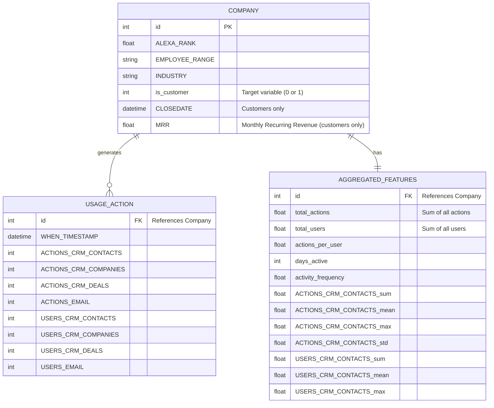
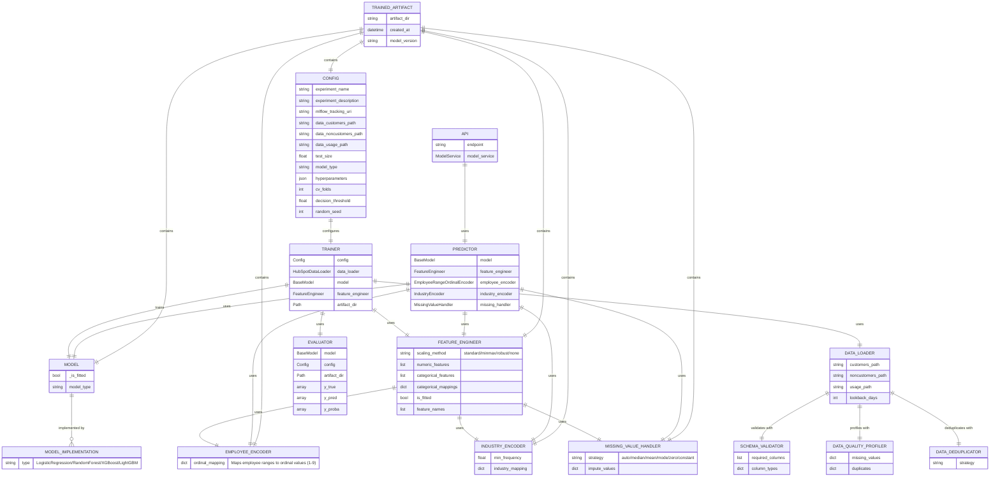
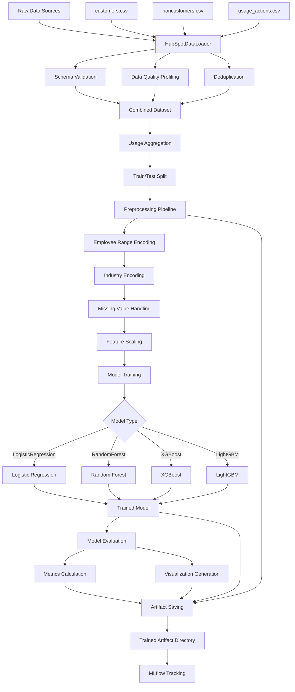
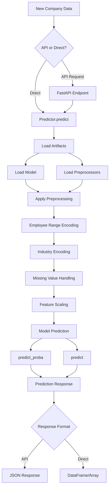
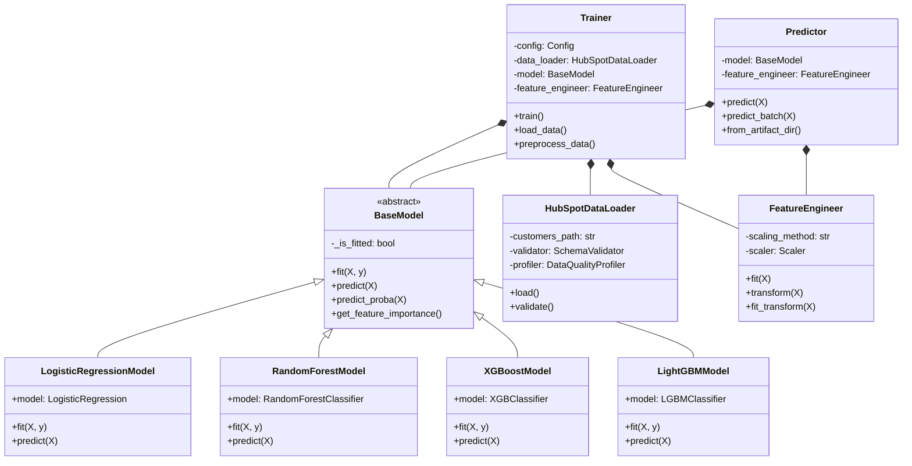
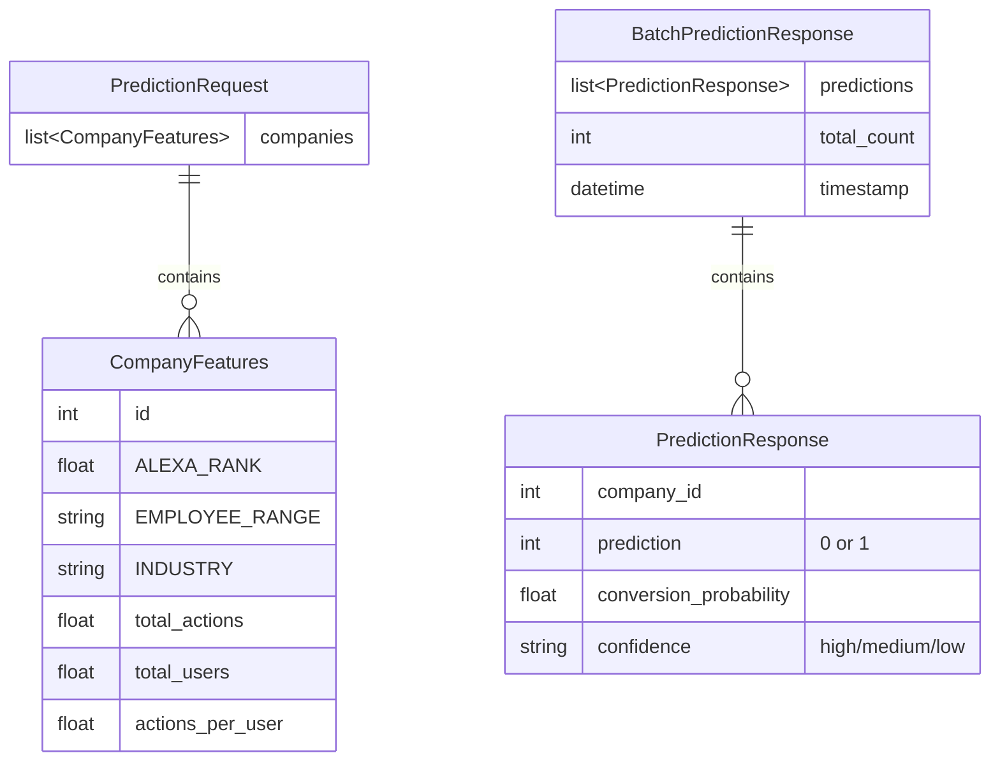

# Entity Relationship Diagram - HubSpot ML Framework

## Overview
This document provides comprehensive Entity Relationship Diagrams (ERD) for the HubSpot ML Framework, covering both data entities and ML pipeline components.

---

## 1. Data Model ERD

### Main Entities and Relationships



**Cardinality:**
- One Company → Many Usage Actions (1:N)
- One Company → One Aggregated Features (1:1)

**Data Sources:**
- `data/customers.csv` - 200 records
- `data/noncustomers.csv` - 5,003 records
- `data/usage_actions.csv` - 25,387 records

---

## 2. ML Pipeline Components ERD

### Core ML Components and Their Relationships



---

## 3. Data Flow Diagram

### Training Pipeline Flow



### Inference Pipeline Flow



---

## 4. Component Hierarchy

### Class Inheritance and Composition



---

## 5. Artifact Storage Structure

```
artifacts/
└── experiment_name_YYYYMMDD_HHMMSS/
    ├── model.joblib                    # Trained model
    ├── feature_engineer.joblib         # Feature scaler
    ├── employee_encoder.joblib         # Employee range encoder
    ├── industry_encoder.joblib         # Industry encoder
    ├── missing_handler.joblib          # Missing value handler
    ├── config.yaml                     # Training configuration
    ├── metrics.json                    # Evaluation metrics
    ├── feature_importance.csv          # Feature importance scores
    ├── confusion_matrix.png            # Confusion matrix plot
    ├── roc_curve.png                   # ROC curve plot
    └── training_log.txt                # Training logs
```

---

## 6. API Endpoints and Data Models

### Request/Response Schema



### API Endpoints

| Endpoint | Method | Input | Output |
|----------|--------|-------|--------|
| `/` | GET | - | Welcome message |
| `/health` | GET | - | Health status |
| `/predict` | POST | `PredictionRequest` | `BatchPredictionResponse` |
| `/predict/single` | POST | `CompanyFeatures` | `PredictionResponse` |

---

## 7. Key Relationships Summary

### Data Entity Relationships
- **Company → UsageAction**: 1:N (One company generates many usage actions)
- **Company → AggregatedFeatures**: 1:1 (Each company has aggregated usage statistics)

### ML Component Relationships
- **Config → Trainer**: 1:1 (Config drives training process)
- **Trainer → Model**: 1:1 (Trains one model per run)
- **Trainer → FeatureEngineer**: 1:1 (Uses one feature engineering pipeline)
- **Predictor → Model**: 1:1 (Loads one trained model)
- **Predictor → Preprocessors**: 1:N (Uses multiple preprocessing components)
- **API → Predictor**: 1:1 (Wraps one predictor instance)

### Artifact Relationships
- **TrainedArtifact → Model**: 1:1 (Saved model)
- **TrainedArtifact → Preprocessors**: 1:N (Multiple preprocessing components)
- **TrainedArtifact → Config**: 1:1 (Training configuration)

---

## File References

- **Data Models**: `data/customers.csv`, `data/noncustomers.csv`, `data/usage_actions.csv`
- **Base Classes**: `src/ml_framework/models/base.py`, `src/ml_framework/data/base.py`
- **Implementations**: `src/ml_framework/models/implementations.py`
- **Data Loading**: `src/ml_framework/data/loaders.py`
- **Preprocessing**: `src/ml_framework/data/transformers.py`
- **Training**: `src/ml_framework/training/trainer.py`
- **Serving**: `src/ml_framework/serving/predictor.py`, `src/ml_framework/serving/api.py`
- **Configuration**: `configs/config.yaml`, `src/ml_framework/utils/config.py`
